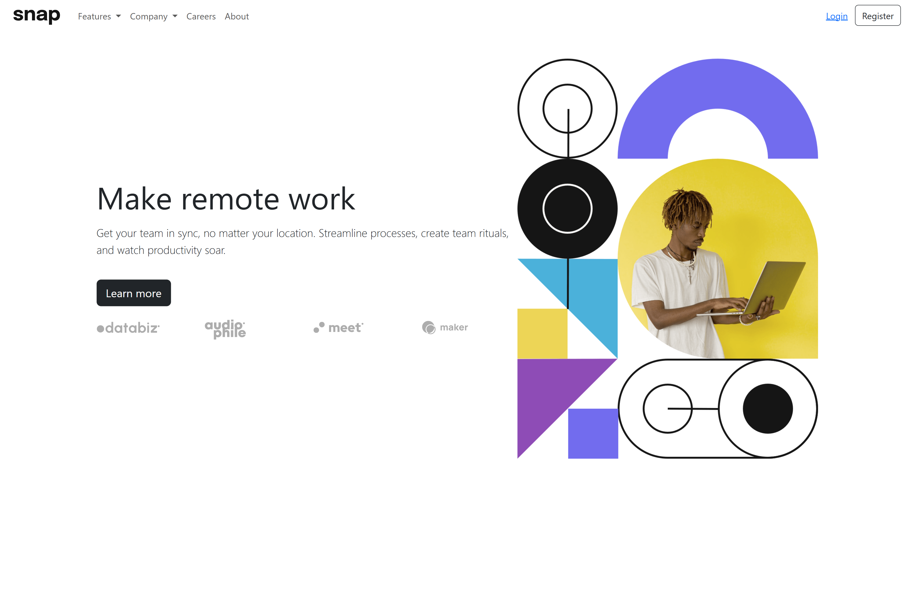

# mtm6404-frontend-mentor-90541115588
## Challenge: Intro Section with Dropdown Navigation

**Name:** Manpreet Singh  
**Student Number:** 90541115588  
**Challenge Attempted:** Intro section with dropdown navigation

This is a solution to the [Intro section with dropdown navigation challenge on Frontend Mentor](https://www.frontendmentor.io/challenges/intro-section-with-dropdown-navigation-ryaPetHE5). This project helped me to strengthen my front-end development skills by implementing responsive navigation and layout and I got to know how to create responsive and attractive drop down menus.

## Table of Contents
- [Overview](#overview)
  - [The Challenge](#the-challenge)
  - [Screenshot](#screenshot)
  - [Links](#links)
- [My Process](#my-process)
  - [Built With](#built-with)
  - [What I Learned](#what-i-learned)
  - [Continued Development](#continued-development)
  - [Useful Resources](#useful-resources)
- [Author](#author)
- [Acknowledgments](#acknowledgments)

## Overview

### The Challenge

Users should be able to:

- View dropdown menus on both desktop and mobile.
- Experience a responsive layout that is responsive for different screen sizes.
- See hover states for all interactive elements

### Screenshot



### Links
- Solution URL: [Add solution URL here](https://https://github.com/90541115588/mtm6404-frontend-mentor-90541115588)

## My Process

### Built With

- HTML
- CSS
- Mobile-first workflow
- Bootstrap 5 for responsive navigation
- Custom JavaScript for navigation behavior

### What I Learned

This project helped me enhance my understanding of responsive design and dropdown navigation implementation. Below is a snippet of my HTML structure for handling responsive layout:

```html
<div class="hero-image col-md-5 text-center order-0 order-md-1">
  
</div>
<div class="hero-text col-md-7 text-center text-md-start order-1 order-md-0">
  <h1 class="display-4"><b>Make remote work</b></h1>
</div>
```

The use of `order-0` and `order-md-1` allows me to swap the content order based on screen size.

### Continued Development

I plan to continue refining my responsive design skills and improve the use of custom dropdown navigation to make the interactions more seamless.

### Useful Resources

- [Bootstrap Documentation](https://getbootstrap.com/docs/5.3/) - Helped me set up a responsive navigation bar quickly.
- [MDN Flexbox Guide](https://developer.mozilla.org/en-US/docs/Web/CSS/CSS_Flexible_Box_Layout/Basic_Concepts_of_Flexbox) - Provided a deeper understanding of how to manage layout for responsive design.

## Author
- Website - Manpreet Singh
- Frontend Mentor - [Manpreet Singh](https://www.frontendmentor.io/profile/90541115588)

## Acknowledgments

Thanks to the Frontend Mentor community for their support. This prohect helped me be able to create attractive dropdown menus and front end interface, and gave me great ideas for improving the user experience.

---

This README file outlines the structure and approach I used to complete the challenge.
